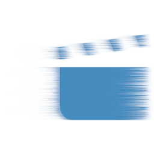
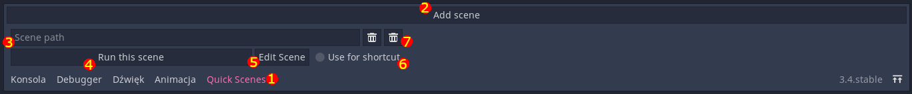
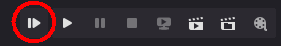
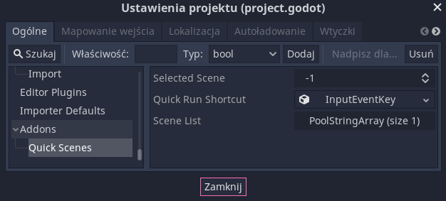

#  Godot Quick Scenes
This plugin allows you to select multiple scenes for quick access. You can quickly edit the scene or run it. There is also dedicated shortcut for running selected scene.

## Usage

Enable the plugin in Project Setttings. Quick Scenes should appear in your bottom pannel. It looks like this (after you press the Add Scene button):

1. Opens the scenes panel.
2. Adds a new empty scene entry.
3. Adds a new scene entry with path to the currently opened scene. Disabled when the scene is empty.
4. Path to the scene file.
5. Runs the scene at the provided path.
6. Opens the scene in the editor.
7. If this is checked, this scene will be ran after pressing the shortcut (default is <kbd>F9</kbd>) in the editor.
8. Hold this button for half second to delete the scene. You can't undo this action.
9. The buttons are disabled if the path does not point to a valid scene.

You can assign the scene path by right-clicking a scene file, selecting "Copy Path" option and pasting in the path field. You can also drag and drop it.

The shortcut scene can also be started using a dedicated button:

## Settings

The addon stores a few settings in the `project.godot` file. They can be changed in "Addons/Quick Scenes" section of Project Settings.

Here you can configure the shortcut used for quick-running scene.

The other settings are used internally by the plugin. Don't touch them.
Your scenes are stored as UIDs, so the plugin is capable of "auto-updating" them. If you move a scene referenced by the plugin, just reload the plugin and the path will be updated.

___
You can find all my addons on my [profile page](https://github.com/KoBeWi).

