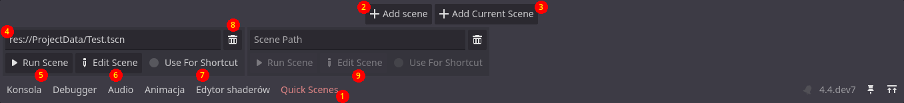

#  Godot Quick Scenes
This plugin allows you to select multiple scenes for quick access. You can quickly edit the scene or run it. There is also dedicated shortcut for running selected scene.

## Usage

Enable the plugin in Project Setttings. BQuick Scenes should appear in your bottom pannel. It looks like this (after you press the Add Scene button):

1. Opens the scenes panel.
2. Adds a new empty scene entry.
3. Adds a new scene entry with path to the currently opened scene. Disabled when the scene is empty.
4. Path to the scene file.
5. Runs the scene at the provided path.
6. Opens the scene in the editor.
7. If this is checked, this scene will be ran after pressing the shortcut (default is <kbd>F9</kbd>) in the editor.
8. Drag this button to reorder scenes.

9. Click this button to quick load a scene.
10. Click this button to delete the scene.
11. The buttons are disabled if the path does not point to a valid scene.

The Quick Scenes dock also supports vertical and floating layouts (just right-click the dock button, or drag it). You can assign the scene path by right-clicking a scene file, selecting "Copy Path" option and pasting in the path field. You can also drag and drop it, or use the Quick Load button. The dock supports undo/redo (except for editing the path text manually).

The shortcut scene can also be started using a dedicated button:

## Settings

The addon comes with a few settings.
- The project setting `addons/quick_scenes/scene_list_file` defines a file that keeps the list of all quick scenes. By default it's `res://quick_scenes.txt`. Changing it to another file will automatically move the old list, if the new file does not exist yet.
- The editor setting `addons/quick_scenes/show_quick_run_label` customizes an optional label that will appear next to the run button. It has 3 modes: Hidden, Filename Only, and Full Path.

- The editor setting `addons/quick_scenes/max_quick_run_label_width` controls the width of the aforementioned label.
- The editor shortcut `Quick Scenes > Run Quick Scene`, used for running the scene marked for shortcut.

## Localization

The addon supports translations and will automatically use the editor's language, if available. Currently only Polish translation is available. To make a new translation use the QuickSceneRunner.pot file found in the addon's folder and feel free to open a pull request.

___
You can find all my addons on my [profile page](https://github.com/KoBeWi).

